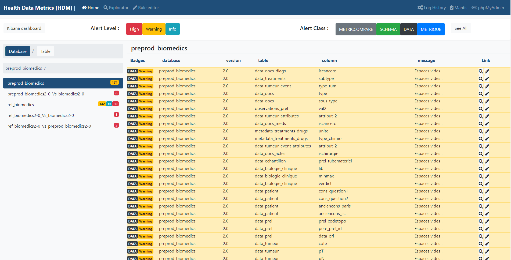
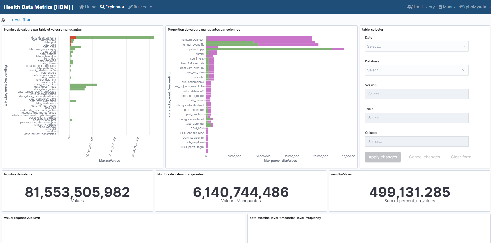
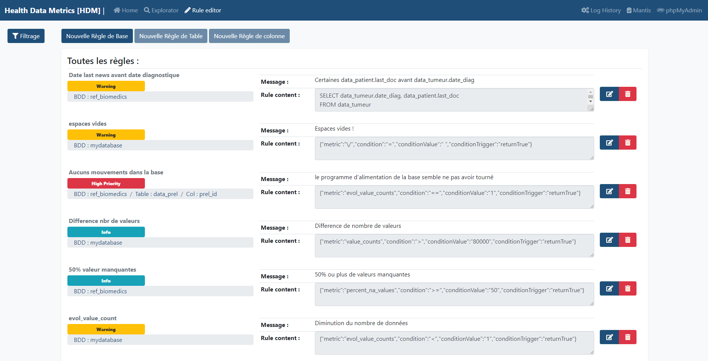

* [Goal](#goal)
* [Get Started](#get-started)
	* [Dependencies](#dependencies)
	* [Configuration](#configuration)
		* [Application Configuration File](#application-configuration-file)
		* [LDAP Configuration File](#ldap-configuration-file)
		* [NFS Configuration File](#nfs-configuration-file)
	* [Run it !](#run-it-)
		* [Docker Image](#docker-image)
		* [Helm Chart](#helm-chart)
		* [From Sources](#from-sources)
		* [Going Deeper](#going-deeper)
* [Screenshots & User Guide](#screenshots--user-guide)
* [Build the doc](#build-doc)

# Goal

The main goal of HDM is to help asses data quality by running ad-hoc programs that "scan" databases regularly to compute metrics & calculate divergence wether in structure or content of databases. Generating alerts that gives Data Engineers insights on what broke down.

To do this we have developed the following features:

Calculate metrics on the data from our warehouses.

* Set up rules to be able to apply operational / business constraints on the databases in connection with the calculated metrics.
* Detect breaks and regressions in the database structure or in the data itself by generating alerts using business rules.
* Allow constraints to be centralized and create a unified HUB to manage data quality in order to deliver the best possible quality data to doctors and researchers.
* Create dashboards on metrics to be able to visualize and explore them.

# Get Started

As you may have understood, Health Data Metrics needs an **ecosystem** of application in order to work.

## Dependencies

- Elasticsearch `>=v7.10.0`
  - Elasticsearch Installed and API Endpoint accessible.

- Kibana `>=v7.10.0`
  - Kibana Installed and API Endpoint accessible.

- Airflow `>=v2.1.0`
  - Airflow Installed and API Endpoint accessible.
  - HDM Pipeline imported, setup & running (See More on [Airflow Pipeline](#Airflow-Pipeline).

- Nexus `>=3.29.2-02`
	- Nexus Installed and API Endpoint accessible.
	- Default Repository
	- User / Password with rights to [Read artifacts, Search Queries]

## Configuration

### Application Configuration File

`/var/www/html/conf/appli/conf-appli.json` :

```json
{
    "AUTH": {
        "AUTH_MODE": "none",
        "AUTH_LDAP_CONF_PATH": "\/conf\/ldap\/conf-ldap.json"
    },
    "DB": {
        "DB_CONF_PATH": "\/conf\/db\/conf-db.json",
        "DB_CREATE_SCRIPT_PATH": "\/conf\/db\/create_tables.sql"
    },
    "EXPLORER": {
        "KIBANA_URL": "http:\/\/localhost:5601\/",
        "KIBANA_NAMESPACE": "default",
        "KIBANA_HOME_DASHBOARD": "",
        "KIBANA_EXPLORATOR_DASHBOARD": "",
        "KIBANA_EXPLORATOR_INDEX": ""
    },
    "PACK": {
        "NEXUS_URL": "http:\/\/nexus:8081\/",
        "NEXUS_API_URL": "http:\/\/nexus:8081\/service\/rest\/v1\/",
        "NEXUS_PACKS_ROOT_REPOSITORY": "hdm-snapshots"
    },
    "PIPELINE": {
        "PIPELINE_RUNNING_MODE": "airflow",
        "AIRFLOW_URL": "http:\/\/localhost:8080\/"
    }
}
```

`/var/www/html/conf/db/conf-db.json` :

```json
{
  "hdm-nexus-creds": {
      "user": "",
      "password": ""
  },
  "hdm-core-database": {
      "user": "hdm",
      "password": "password",
      "host": "mysql",
      "port": "3306",
      "database": "dbhdm",
      "ssl": "false"
  },
  "hdm-nosql-database": {
      "user": "",
      "password": "",
      "host": "elasticsearch",
      "namespace": "default",
      "port": "9200",
      "ssl": "false"
  },
  "hdm-sql-database": {
      "user": "hdm",
      "password": "password",
      "host": "mysql",
      "port": "3306",
      "database": "dbhdm",
      "ssl": "false"
  },
  "hdm-scanned-database": [
    {
        "user":"hdm",
        "host":"mysql",
        "port":"3306",
        "database":"dbtoscan",
        "ssl": "false"
    }
    ]
}
```

## Run it !

You can run job orchestrator from 3 different ways :

### Docker Image

To run anywhere :

```bash
docker run -p 80:80 -v conf/:/var/www/html/conf/ ghcr.io/curie-data-factory/hdm:latest
```

### Helm Chart

To deploy in production environments :

```bash
helm repo add curiedfcharts https://curie-data-factory.github.io/helm-charts
helm repo update

helm upgrade --install --namespace default --values ./my-values.yaml my-release curiedfcharts/hdm
```

More info [Here](https://artifacthub.io/packages/helm/curie-df-helm-charts/hdm)

### From sources

For dev purposes :

1. Clone git repository :
```bash
git clone https://github.com/curie-data-factory/health-data-metrics.git
cd health-data-metrics/
```
2. Create Conf files & folders :
```bash
touch conf/ldap/conf-ldap.json
```
3. Set configuration variables [see templates above](#configuration)
4. Then run the [Docker Compose](https://docs.docker.com/compose/) stack.

```bash
docker-compose up -d
```

* [http://localhost:80](http://localhost:80) Hdm front
* [http://localhost:8081](http://localhost:8081) Nexus
* [http://localhost:5601](http://localhost:5601) Kibana
* [http://localhost:9200](http://localhost:9200) Elasticsearch
* [tcp://127.0.0.1:3306](tcp://127.0.0.1:3306) MySQL Endpoint
  > (host: 127.0.0.1 Port: 3306 User: hdm Password: password Database: dbhdm)

5. Resolve composer package dependencies. See [Here](https://getcomposer.org/doc/00-intro.md) for installing and using composer.

```bash
docker exec -ti hdm sh -c "composer install --no-dev --optimize-autoloader"
```

### Going deeper

You can install Airflow and run the entire stack on local if you have enough RAM & CPU (4 core & 16 Go RAM recommended).
To see how : go [Here](./docs/full-installation.md)

# Screenshots & User Guide





# Build Doc

The documentation is compiled from **markdown sources** using [Material for MkDocs](https://squidfunk.github.io/mkdocs-material/)
To compile the documentation :

1. Go to your source directory :

```bash
cd health-data-metrics
```

2. Run the docker build command :

```bash
docker run --rm -i -v "$PWD:/docs" squidfunk/mkdocs-material:latest build
```

____
Data Factory - Institut Curie - 2021
