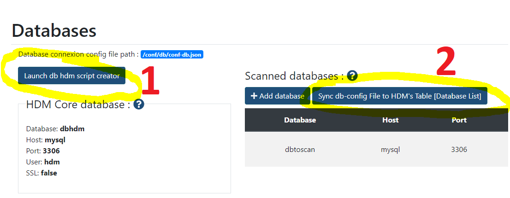
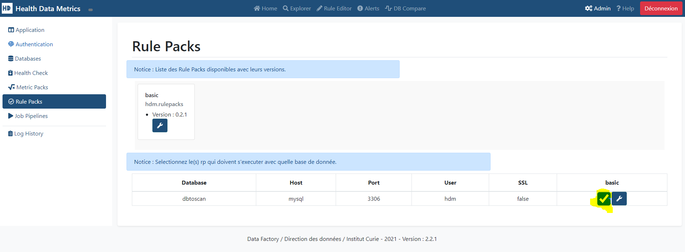
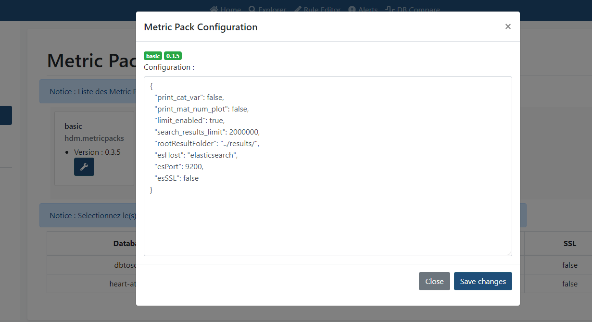

# HDM Full Installation

This Tutorial guides you on How to install hdm full stack on your local machine.

**⚠️	 REQUIREMENTS ⚠️**

Software :

* Linux/MacOS 64bit or Windows 10 64bit **with WSL2**
* Docker
* Docker-compose
* Python 3.9+

Hardware :
**Minimal**🤓
>
	- CPU     :   4 Cores
	- RAM     :  16 Go
	- Storage :  10 Go

Hardware :
**Recommended**  😎
>
	- CPU     :  12 Cores
	- RAM     :  32 Go
	- Storage :  30 Go

In this Tutorial, we are going to install HDM in Full Stack mode. That means that we are going to :

> ⚠️ Before we start : **all comandlines have to be executed at the root folder of the git source repository**

[1. **Launch** all the **software stack** :](#1-launch-all-the-software-stack)

	- Airflow
	- Nexus
	- Elasticsearch
	- Kibana
	- MySQL
	- HDM frontend

[2. **Ingest some dataset** to our **MySQL** database, simulating a dataware that we want to scan.](#2-ingest-a-dataset)

[3. **Register our Metric Packs & Rule Packs** on **Nexus** and configure them into **HDM**.](#3-metric-pack--rule-pack-registration)

[4. **Add an Airflow DAG** to run them.]()

[5. **Run** our HDM Airflow DAG and **compute metrics/alerts**.]()

[6. Finally, add our **Kibana Dashboards** and use the Explorer and **Alert Dashboard**.]()

___

## 1. Launch all the software stack

To run the stack we need :

* `Docker` See [Get Docker](https://docs.docker.com/get-docker/)
* `Docker Compose` See [Get Docker Compose](https://docs.docker.com/compose/install/)

We are going to run the `docker-compose` files :
- `docker-compose.yml` (HDM primary Stack)
- `docker-compose-airflow.yml` (Airflow Stack) More INFO [Here](https://airflow.apache.org/docs/apache-airflow/stable/start/docker.html#)

```bash
bash tutorials/full-installation/launch-stack.sh
```

When the installation is complete, you should check the different application endpoints :

* [http://localhost:80](http://localhost:80) HDM
* [http://localhost:8081](http://localhost:8081) Nexus
* [http://localhost:5601](http://localhost:5601) Kibana
* [http://localhost:8080](http://localhost:8080) Airflow (User: airflow | Password: airflow)
* [tcp://127.0.0.1:3306](tcp://127.0.0.1:3306) MySQL Endpoint
  > **host**: 127.0.0.1 | **Port**: 3306 | **User**: hdm | **Password**: password | **Database**: dbhdm

  or:

  > **host**: 127.0.0.1 | **Port**: 3306 | **User**: root | **Password**: rootpassword

When you have all done. Let's go to the next step.

___

## 2. Ingest a Dataset

We are using the [Kaggle API](https://github.com/Kaggle/kaggle-api) to download our example datasets.

### 2.1 Kaggle cli installation
In a Client with python 3 on it, run :

```bash
pip install kaggle --upgrade
```

### 2.2 Kaggle cli login
Type `kaggle` to check if kaggle is installed.

Run the commandline if needed :

>
	Warning: Your Kaggle API key is readable by other users on this system! To fix this, you can run 'chmod 600 /home/<User>/.kaggle/kaggle.json'

Test with : ` kaggle datasets list`

### 2.3 Download Heart Attack Dataset

```bash
kaggle datasets download rashikrahmanpritom/heart-attack-analysis-prediction-dataset -p ./datasets --unzip
```

### 2.4 Run Ingestion Script

We are now going to ingest our Kaggle dataset to our MySQL database.

```bash
bash tutorials/full-installation/ingest-data.sh
```

Data is ingested ! Check it out on **mysql://127.0.0.1:3306/heart-attack**

___

## 3. Metric Pack & Rule Pack Registration

In this step, we are going to register the metric pack and rule pack that are used for HDM.

### 3.1 Setup Nexus

1. In order to setup Nexus we need to get the password :

```bash
docker exec -ti nexus sh -c "cat /nexus-data/admin.password"
```

This will give you the **admin** password for [Nexus](http://localhost:8081/)

2. Go to [http://localhost:8081/](http://localhost:8081/) and login as "admin" + [Password from previous command]

3. Do the setup by changing the default admin password and then checkout the **[x][Enable Anonymous Access]**

### 3.2 Run Nexus Import Script

⚠️ Change the **PASSWORDNEXUS** to your Nexus **admin** password value.

```bash
# Nexus User Credentials
export PASSWORDNEXUS="123qwe"
export USERNEXUS="admin"
```

And run the script :

```bash
bash tutorials/full-installation/mp-rp-nexus-register.sh
```

This script will create a Maven2 Repository on Nexus named : **hdm-snapshots**

The script then packages into zip files the metric pack & rule pack basic and upload them into the maven repository.

Check if it's ok : [http://localhost:8081/#browse/browse:hdm-snapshots](http://localhost:8081/#browse/browse:hdm-snapshots)

___

### 3.3. HDM DB Initialization

We now have to initialize the hdm core db
Go to the [Databases] Admin Tab [http://localhost/admin.php?tab=databases](http://localhost/admin.php?tab=databases)

Then click in this order on :

1. [Launch db hdm script creator]
2. [Sync db-config File to HDM's Table [Database List]]



___

### 3.4. Metric Pack & Rule Pack Configuration

#### 3.4.1 Enabling Metric Pack / Rule Pack

We Then have to activate our mp & rp on :

* http://localhost/admin.php?tab=metricpacks
* http://localhost/admin.php?tab=rulepacks




#### 3.4.2 Edit Configuration Metric Pack / Rule Pack


We edit our metric pack configuration to add :

```json
{
  "print_cat_var": false,
  "print_mat_num_plot": false,
  "limit_enabled": true,
  "search_results_limit": 2000000,
  "rootResultFolder": "../results/",
  "esHost": "elasticsearch",
  "esPort": 9200,
  "esSSL": false
}
```


And same for our rule pack with :

```text
dev
```

___

## 4. Airflow DAG

Login to Airflow [http://localhost:8080/home](http://localhost:8080/home) with (login : airflow | password: airflow)

### 4.1 Add env variables :

In your previous terminal run these commands :

```bash
# Airflow User Credentials
export PASSWORDAIRFLOW="airflow"
export USERAIRFLOW="airflow"

# Add variables
curl -u $USERAIRFLOW:$PASSWORDAIRFLOW -X POST "http://localhost:8080/api/v1/variables" -H  "accept: application/json" -H  "Content-Type: application/json" -d "{\"key\":\"env\",\"value\":\"dev\"}"
```

They will create all the airflow environment variables in order for our DAG to run.

And then Copy python files :

```bash
mkdir dags/packs
cp -r packs/* dags/packs/
```

### 4.2 Enable the dag :

Toggle the dag :


___

## 5. Run the dag

Trigger the dag :


You can check it's execution :

[http://localhost:8080/graph?dag_id=hdm-pipeline](http://localhost:8080/graph?dag_id=hdm-pipeline)

___

## 6. HDM Visualisation

### 6.1 Import kibana dashboard

Run the following comandline to import all the dashboards from the Basic Metric Pack into kibana.

```bash
curl -X POST http://localhost:5601/api/saved_objects/_import?overwrite=true -H "kbn-xsrf: true" --form file=@packs/hdm-metric-packs/basic/kibana-dashboard/export.ndjson
```

### 6.2 Explorer Dashboard

You can explore the different metric pack dashboards from the Explorer.

[http://localhost/explorer/wrapper.php](http://localhost/explorer/wrapper.php)

### 6.3 Alert Dashboard

You can check all the alerts emmitted by the different rule packs from the Alert dashboard :

[http://localhost/alert/alert.php](http://localhost/alert/alert.php)

## 7. Stopping HDM Stack :

To stop the stack :

```bash
docker-compose -f docker-compose.yml down
docker-compose -f docker-compose-airflow.yaml down -v
docker-compose down -v
```
