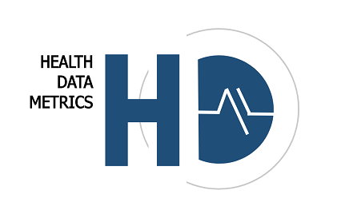
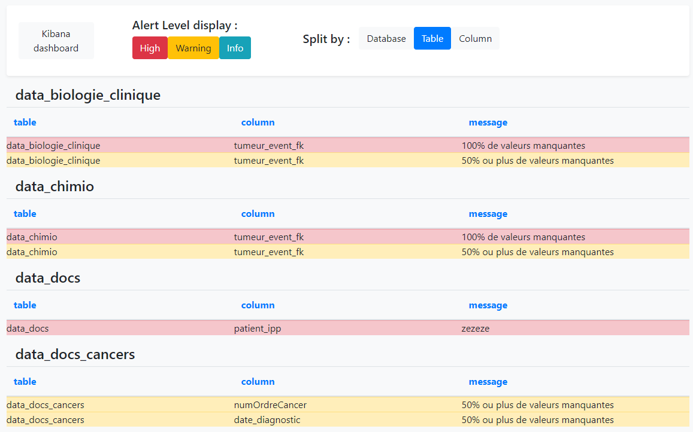
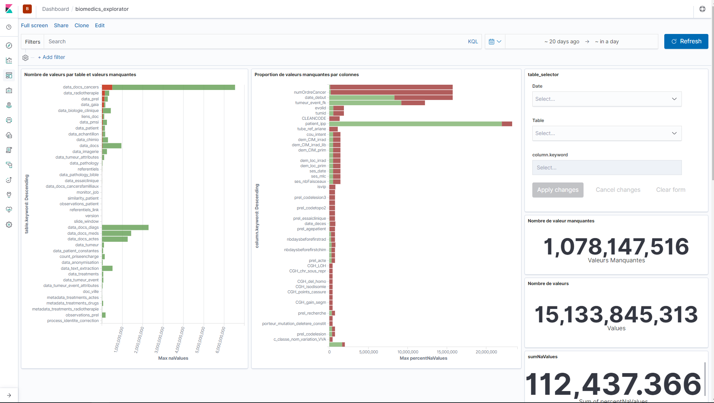

# Qu'est-ce que HDM ?

Health data metrics (HDM) est un outil développé par la **Data Factory** de **l'Institut Curie**. 

## Le but

Son but est de pouvoir calculer des métriques de qualité sur de la donnée médicale et son stockage dans les entrepôts de données.

1. Le but premier est de pouvoir **améliorer** et **monitorer** la **qualité des données** de nos entrepôts de donnée de santé.

Pour ce faire nous avons développé les fonctionnalités suivantes :

* Calculer des **métriques** sur les données de nos entrepôts.
* Mettre en place des **règles** pour pouvoir appliquer des **contraintes opérationnelles/métiers** sur les bases de données en lien avec les métriques calculées.
* **Détecter** les ruptures et régressions dans la structure de la base de données ou dans les données elles-mêmes **en générant des alertes** grâce à des règles métiers.
* Permettre de **centraliser les contraintes** et créer un HUB unifié pour gérer la qualité de la donnée afin de livrer des données de la meilleure qualité possible aux médecins et chercheurs.
* **Créer des dashboards** sur les métriques pour pouvoir les **visualiser** et les **explorer**.

___

## Les principes de base

Il existe une relation hiérarchique dans la façon dont HDM fonctionne :

- Premièrement, nous avons **des bases de données** à sur lesquelles nous allons calculer **des métriques**

Ces métriques peuvent servir différents buts et sont calculées grâce à des **Métriques Packs** qui sont des mini programmes autonomes qui vont se charger de les calculer puis de les insérer dans une **base de données de métrique**.

- Ensuite nous avons les **Rules Packs** dont le but est de pouvoir exploiter les métriques calculées précédemment afin de générer des **alertes** que l'utilisateur pourra consulter.

De la même manière que pour les métriques Packs, les Rule Packs fonctionnent également comme des mini programmes autonomes qui vont se charger cette fois de **générer des règles basées sur les métriques** et de **générer des alertes** si jamais ces règles **ne sont pas respectées**.

## L'architecture Fonctionnelle

HDM fonctionne en articulation de plusieurs outils et technologies que nous allons voir dans la suite : 

Logiciel | Containerized | Version | Usage | url
------------ | ------------- | ------------- | ------------- | -------------
Elasticsearch | Yes | 7.10.0 | Permet de stocker les métriques sous forme de documents pour la construction des dashboards | [https://www.elastic.co/fr/products/elasticsearch](https://www.elastic.co/fr/products/elasticsearch)
Kibana | Yes | 7.10.0 | Permet de réaliser des tableaux de visualisations interactives pour l'analyse exploratoire des métriques | [https://www.elastic.co/fr/products/kibana](https://www.elastic.co/fr/products/kibana)
Python | Yes | 3.6.8 | Permet d'exécuter les scripts pour le calcul des métriques et la génération des alertes | [https://www.python.org/download/releases/3.0/](https://www.python.org/download/releases/3.0/)
Apache  | Yes | php:7.4.5-apache | Serveur Web avec PHP 7 pour l'affichage de la web-Application | [https://hub.docker.com/](https://hub.docker.com/)
MySQL | Yes | 8.0.16 | Base de données relationnelle qui permet de stocker les métriques, les règles et les alertes. | [https://www.mysql.com/fr/](https://www.mysql.com/fr/)
Airflow | Yes | 2.1.0 | Orchestrateur de Tâches. | [https://airflow.apache.org/](https://airflow.apache.org/)

___

## Les composants

### Bases de données

Cet outil intègre 3 bases de données :

- Une base MySQL pour stocker les métriques sous format SQL.
- Une base MySQL pour stocker les données applicatives. (conf , paramètres, logs etc...)
- Une base Elasticsearch pour stocker les métriques sous format NO-SQL.

### Modules Front-end

L'outil de front-end fonctionne de façon modulaire, il existe les modules suivants :

- Explorer (Dashboarding pour explorer les métriques)
- Rule editor (Permet d'éditer les règles de cohérence directement dans l'interface sans lignes de codes)
- Alerts (Permet d'afficher les alertes remontés par les Rule Packs)
- Admin (Permet de gérer l'administration des MP/RP et leur configuration)

### Dashboards

Cet outil peut être utilisé avec les outils suivants :

- Kibana qui permet de créer des vues à partir des documents dans les bases NO-SQL Elasticsearch.
- Redash qui permet de créer des vues à partir des tables de métriques SQL MySQL.

### Orchestrateur & Jobs

Afin de monitorer l'exécution des tâches de calcul de métriques, de règles et d'alertes, nous utilisons Airflow, à travers la définition d'un DAG appelé : `hdm-pipeline`.

___

## Métriques et règles

Comment sont défini et calculés les modules de métriques et de règles ?

Dans HDM il existe ce qu'on appelle des "PACK", les packs sont des mini-modules qui se chargent de calculer soit des métriques, soit des règles de cohérences de données.

Dans la version actuelle de HDM il n'existe qu'un seul pack de métriques mais il est possible d'en rajouter d'autres par la suite sans avoir à modifier l'applicatif.

### Fonctionnement des "MetricPacks" (MP)

Les métriques packs contiennent un fichier `.sh` qui contient la ligne d'exécution du MP, il est à la charge du programmeur du MP de faire toutes les vérifications de dépendances logicielles avant d'exécuter son programme.

Le metricPack peut également contenir un fichier `.ndjson` contenant les visualisation & dashboards Kibana qui sont liés aux données de métriques que produisent son MP.

### Fonctionnement des "RulePacks" (RP)

Les rules packs contiennent un fichier `.sh` qui contient la ligne d'exécution du RP, il est à la charge du programmeur du MP de faire toutes les vérifications de dépendances logicielles avant d'exécuter son programme.

Les rules packs s'exécutent sur les données des MP et ajoutes des alertes dans la table d'alerte de HDM.

## Configuration & Orchestration

La configuration de l'applicatif HDM est interne à l'applicatif lui-même, il existe les configurations suivantes : 

- Configuration LDAP : Permet de se connecter au serveur LDAP, gère l'authentification des utilisateurs et la gestion de leurs droits
- Configuration Application : Quels dashboards Kibana afficher dans quels modules etc...
- Configuration Packs : Connexion au répertoire de Packs (Nexus) Configuration générale des packs

Chaque MetricPack & RulePack peux posséder sa configuration propre. Elle est stockée en base64 dans la base de données applicative.
Chaque MP & RP peut également posséder sa configuration propre par base de données scannée et peut donc adapter son fonctionnement à la base de données cible si besoin. Si cette configuration existe, elle sera chargée en lieu et place de la configuration du MP/RP parente.

L'orchestration est effectuée par un DAG (Directed Acyclic Graph) Airflow qui se chargera de charger les MP/RP puis, de charger leur configuration, et enfin les exécutera sur chaque base de données.

___

## Les métriques de qualités de la donnée

### Les niveaux de métriques

Afin d'évaluer de façon correcte la qualité des données, il est bon de définir des périmètres de calcul de ces métriques.
Nous avons défini 6 niveaux hiérarchiques de métriques; Il est important de ne pas mélanger les niveaux de métriques, et de comparer les métriques entres-elles sur le même niveau.

- Le niveau 0 : 
> Le niveau 0 permet de calculer des métriques à l'échelle de toutes les versions d'une base de données.
- Le niveau 1 : 
> Le niveau 1 permet de calculer des métriques à l'échelle d'une version donnée d'une base de données.
- Le niveau 2 : 
> Le niveau 2 permet de calculer des métriques à l'échelle d'une table, d'une version donnée, d'une base de données.
- Le niveau 3 : 
> Le niveau 3 permet de calculer des métriques à l'échelle d'une colonne indépendamment de son type (exemple : nombres de valeurs manquantes/valeurs NULL).
- Le niveau 4 : 
> Le niveau 4 permet de calculer des métriques à l'échelle d'une colonne en prenant en compte son type de donnée (Numérique, textuelle, catégorique, continue, date, id etc. ...).
- Le niveau 5 : 
> Le niveau 5 permet de calculer des métriques à l'échelle de variables catégoriques : (fréquence, valeur)

> *Schéma de représentation des différents niveaux de calcul de métriques possible.*

___
## Les règles & alertes 
### Les règles 

Basé sur les métriques calculées périodiquement, l'application permet d'assurer un suivi passif (sans intervention humaine) et dynamique (s'adapte aux changements) de la qualité de la donnée, à l'aide de l'outil d'implémentation de règles d'alertes afin de remonter le plus efficacement les anomalies dans la base de données.

> *Affichage de l'interface graphique de l'éditeur de règles.*

### Les Alertes
Les alertes seront présentés sous forme de liste simple et organisés par base de données, table ou colonnes.

> *Affichage de la table des alertes.* 
___
## La visualisation et l'exploration

La visualisation des métriques et leur exploration est une phase importante afin de construire les règles les plus pertinentes possibles. Un outil est à disposition appelé Kibana, basé sur la base de données Elasticsearch. Les dashboard permettrons de visualiser et d'interagir simplement avec les métriques afin de pouvoir détecter les valeurs aberrantes facilement, et de pouvoir faire remonter ces anomalies en alerte grâce à l'éditeur de règles.

> *Affichage de l'interface graphique de dashboard kibana.*
