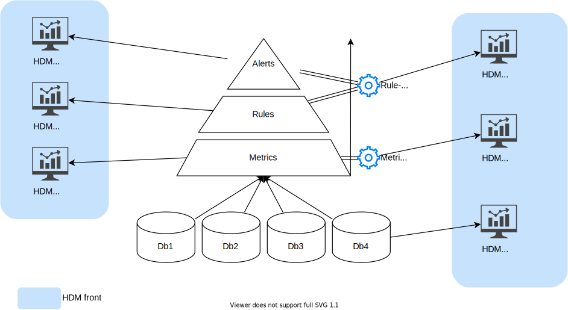
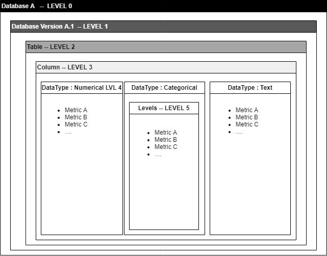

# What is HDM?

Health data metrics (HDM) is a tool developed by the **Data Factory** of **Institut Curie**.

## The goal

Its goal is to be able to calculate quality metrics on medical data and its storage in data warehouses.

1. The primary goal is to be able to **improve** and **monitor** the **data quality** of our health data warehouses.

To do this we have developed the following features:

* Calculate **metrics** on the data from our warehouses.
* Set up **rules** to be able to apply **operational / business constraints** on the databases in connection with the calculated metrics.
* **Detect** breaks and regressions in the database structure or in the data itself **by generating alerts** using business rules.
* Allow to **centralize the constraints** and create a unified HUB to manage the quality of the data in order to deliver the best possible quality data to doctors and researchers.
* **Create dashboards** on metrics to be able to **visualize** and **explore** them.
___

## The basic principles

There is a hierarchical relationship in the way HDM works:

- First, we have **databases** on which we will calculate **metrics**

These metrics can serve different purposes and are calculated using **Metrics Packs** which are self-contained mini programs that will calculate them and then insert them into a **metrics database**.

- Then we have the **Rules Packs** whose goal is to be able to use the metrics calculated previously in order to generate **alerts** that the user can consult.

In the same way as for the metric Packs, the Rule Packs also work as autonomous mini programs which will take charge this time of **generating rules based on the metrics** and of **generating alerts** if ever these rules **are not respected**.

## Functional architecture

HDM works in conjunction with several tools and technologies that we will see below :

Logiciel | Containerized | Version | Usage | url
------------ | ------------- | ------------- | ------------- | -------------
Elasticsearch | Yes | 7.10.0 | Permet de stocker les métriques sous forme de documents pour la construction des dashboards | [https://www.elastic.co/fr/products/elasticsearch](https://www.elastic.co/fr/products/elasticsearch)
Kibana | Yes | 7.10.0 | Permet de réaliser des tableaux de visualisations interactives pour l'analyse exploratoire des métriques | [https://www.elastic.co/fr/products/kibana](https://www.elastic.co/fr/products/kibana)
Python | Yes | 3.6.8 | Permet d'exécuter les scripts pour le calcul des métriques et la génération des alertes | [https://www.python.org/download/releases/3.0/](https://www.python.org/download/releases/3.0/)
Apache  | Yes | php:7.4.5-apache | Serveur Web avec PHP 7 pour l'affichage de la web-Application | [https://hub.docker.com/](https://hub.docker.com/)
MySQL | Yes | 8.0.16 | Base de données relationnelle qui permet de stocker les métriques, les règles et les alertes. | [https://www.mysql.com/fr/](https://www.mysql.com/fr/)
Airflow | Yes | 2.1.0 | Orchestrateur de Tâches. | [https://airflow.apache.org/](https://airflow.apache.org/)

___

## The components

### Data base

This tool integrates 3 databases:

- A MySQL database to store metrics in SQL format.
- A MySQL database to store application data. (conf, parameters, logs etc ...)
- An Elasticsearch database to store metrics in NO-SQL format.

### Front-end modules

The front-end tool works in a modular way, there are the following modules:

- Explore (Dashboarding to explore metrics)
- Rule editor (Allows you to edit consistency rules directly in the interface without code lines)
- Alerts (Allows you to display the alerts sent by the Rule Packs)
- Admin (Used to manage the administration of MP / RP and their configuration)

### Dashboards

This tool can be used with the following tools:

- Kibana which allows you to create views from documents in the NO-SQL Elasticsearch databases.
- Redash which allows you to create views from SQL MySQL metric tables.

### Orchestrator & Jobs

In order to monitor the execution of metrics, rules and alerts calculation tasks, we use Airflow, through the definition of a DAG called: `hdm-pipeline`.

___

## Metrics and rules

How are metrics and rules modules defined and calculated?

In HDM there are what are called "PACKs", the packs are mini-modules which are responsible for calculating either metrics or data consistency rules.

In the current version of HDM there is only one metric pack but it is possible to add others later without having to modify the application.

### Operation of "MetricPacks" (MP)

The metric packs contain a `.sh` file which contains the execution line of the MP, it is the responsibility of the MP programmer to do all the software dependency checks before running his program.

The metricPack can also contain an `.ndjson` file containing the Kibana visualizations & dashboards which are linked to the metrics data that its PM produces.

### How RulePacks (RP) work

The rules packs contain a `.sh` file which contains the line of execution of the RP, it is the responsibility of the programmer of the MP to do all the software dependency checks before running his program.

The rule packs are executed on the data of the PMs and add alerts in the alert table of HDM.

## Configuration & Orchestration

The configuration of the HDM application is internal to the application itself, there are the following configurations:

- LDAP configuration: Used to connect to the LDAP server, manage user authentication and manage their rights
- Application configuration: Which Kibana dashboards to display in which modules etc ...
- Packs configuration: Connection to the Packs directory (Nexus) General configuration of the packs

Each MetricPack & RulePack can have its own configuration. It is stored in base64 in the application database.
Each MP & RP can also have its own configuration per scanned database and can therefore adapt its operation to the target database if necessary. If this configuration exists, it will be loaded instead of the configuration of the parent MP / RP.

The orchestration is performed by a DAG (Directed Acyclic Graph) Airflow which will load the MP / RP then load their configuration, and finally run them on each database.

___

## Data quality metrics

### Metric levels

In order to correctly assess the quality of the data, it is good to define the calculation scopes of these metrics.
We have defined 6 hierarchical levels of metrics; It is important not to mix the metric levels, and to compare the metrics on the same level.

- Level 0:
> Level 0 is used to calculate metrics at the scale of all the versions of a database.
- Level 1:
> Level 1 is used to calculate metrics at the scale of a given version of a database.
- Level 2:
> Level 2 is used to calculate metrics at the scale of a table, a given version, or a database.
- Level 3:
> Level 3 is used to calculate metrics at the scale of a column regardless of its type (example: number of missing values ​​/ NULL values).
- Level 4:
> Level 4 is used to calculate metrics at the scale of a column by taking into account its type of data (Numeric, textual, categorical, continuous, date, id etc. ...).
- Level 5:
> Level 5 is used to calculate metrics on the scale of categorical variables: (frequency, value)

> *Diagram showing the different levels of metric calculation possible.*

___

## Rules & alerts

### The rules

Based on the metrics calculated periodically, the application makes it possible to ensure passive (without human intervention) and dynamic (adapts to changes) monitoring of the quality of the data, using the implementation tool of alert rules in order to report anomalies in the database as efficiently as possible.

> *Display of the rule editor graphical interface.*

### Alerts

Alerts will be presented as a simple list and organized by database, table or columns.

> *Display of the alerts table.*

___

## Visualization and exploration

The visualization of metrics and their exploration is an important phase in order to build the most relevant rules possible. A tool is available called Kibana, which is based on the Elasticsearch database. The dashboards will make it possible to visualize and simply interact with the metrics in order to be able to easily detect outliers, and to be able to raise these anomalies in alert thanks to the rule editor.

> *Display of the kibana dashboard graphical interface.*