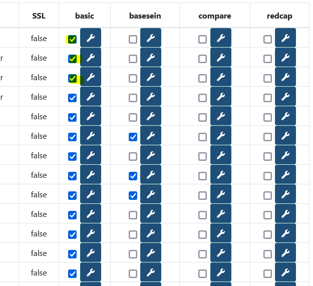
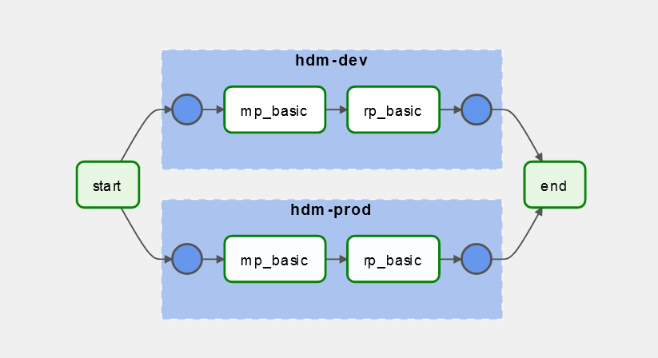

# HDM Packs

Packs in HDM are autonomous micro programs which allow processing on :

* Databases (Metric Packs)
* Metrics (Rule Packs)

There are only two types of HDM packs at the moment.

## Tree structure

The package tree must meet a standard in order to be able to build automated systems and services in the future.

| File | Description |
|------|-------------|
| Readme.md | Used to explain how the pack works  |
| requirements.txt | package software dependencies |
| properties.json | [Properties.json](#propertiesjson) |
| bootstrap-script.sh | [bootstrap-script.sh](#bootstrap-scriptsh) |
| /process | The process folder contains the program as such |
| /process/conf.json | the conf.json file contains the minimum local configuration when the pack is run |
| /process/code.(py,jar,etc...) | the program code in any format (no constraints) |
| /kibana-dashboard | If necessary (for metric packs) this folder will contain the kibana / elasticsearch files to install the visualizations/dashboards of the pack |
| /kibana-dashboard/export.ndjson | the kibana visualizations file |
| /create-table | The folder which contains the SQL script (s) necessary for the operation of the pack |
| /create-table/create.sql | sql file |

### Properties.json

The package properties.json file should contain basic information to allow listing in the future.

* name : Name of the pack
* version : Version of the pack
* author : author
* description : One line description
* mainscript : main, but can be in the `.sh` also

```json
{
	"name":"basic",
	"version":"0.3.7",
	"author":"armand leopold",
	"description": "Ce pack contient des métriques de base ainsi que l'analyse du delta d'un jour a l'autre des mêmes metriques, et ajoute un coefficient de leur variation.",
	"mainscript":"metrics.py"
}
```

### Bootstrap-script.sh 

The bootstrap script file is a necessary file that serves as an entry point for the program that is going to be executed.
If necessary, we will include the installation of dependencies and binaries required for the proper execution of the program.
Finally, we will include the command to launch the program (s) of the pack.

```bash
#!/bin/bash
# This script will be executed first at the installation of the pack
# Put Here everything that needs to be installed in order for the metric script to run properly

pip install --upgrade pip 
pip install -r requirements.txt
cd process
python metric_basic.py
```

## Configuration management

The configuration management is left free to the author of the pack for the most part, except in the following cases:

1. Retrieving the list of endpoints on which the pack must run.
2. The specific configuration for each endpoint
3. The external configuration of the pack (excluding credentials) will change regularly.

### 1. List of target endpoints

What is not meant by "target endpoints" are the set of connection chains or URLs which the Pack accesses occasionally to perform its work and against which it reads and retrieves information.

This list of endpoints is managed centrally by HDM in order to have an overview at a glance from the interface, of the different actions of the packs.

The list of these endpoints can be modified via the administration interface by clicking on the boxes in the activation matrix:



Each time an endpoint is activated, a row is added to the table :

-  `hdm_core_table_corr_db_mp` for Metric Packs
-  `hdm_core_table_corr_db_rp` for Rule Packs

Containing the **slug** of the connection string in the `db_key` field as well as the name of the pack in:` mp_key` or `rp_key` for a metric pack or a rule pack.

Each pack must be able to connect to the HDM base to retrieve this configuration.

!!! Warning 
	Please note, the chain slug **does not contain credentials**. You will need to find another way to retrieve the connection string password. By using an **online credentials store** like [Vault](https://www.vaultproject.io/) or [Keycloack](https://www.keycloak.org/).
	You can also store credentials in the local pack configuration as a last resort and only for "readonly" accounts.

### 2./3. Configuration of termination points and external configuration of packs

HDM also gives the possibility of centralizing the configuration specific to each endpoint for each pack.

In the interface, the configuration is also located in the activation matrix (see image above) to the right of the activation button.

The configuration is then encoded in **base64** and stored in the table:

- `hdm_pack_metric_conf` for Metric Packs
- `hdm_pack_rule_conf` for Rule Packs

These tables also contain `the external configuration of the pack` the subtlety is as follows:

The `config_id` contains either:

- The pack id + version: **pack: version** if it is an external configuration.
- The pack id + the connection string slug: **pack: slug** if it is a configuration linked to an endpoint.

This table is also to be requested by the pack to retrieve its configuration and the endpoint configurations.

## Pack orchestration



For pack orchestration, the proposed solution is to use an Airflow DAG.
The dag airflow makes it possible to centralize the execution of packs as "tasks", to configure an execution rate, to monitor the tasks executed and the correct functioning of the sequences of tasks.

Indeed, the packs functioning independently of one another may nevertheless require resources from other packs to function. For example, rule packs need metric packs to execute their rules. Airflow, because of its execution graph allows to ensure a correct sequence of packs one after the other in a defined order, it allows to avoid any corruption in the analyzes and prevents the emission of false alerts.